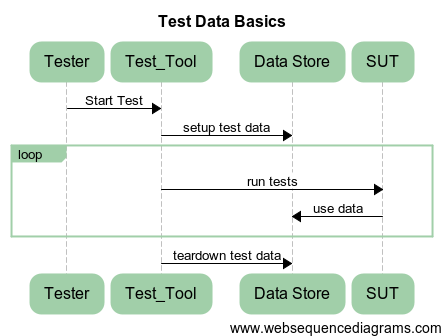
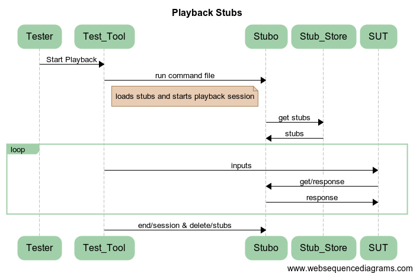
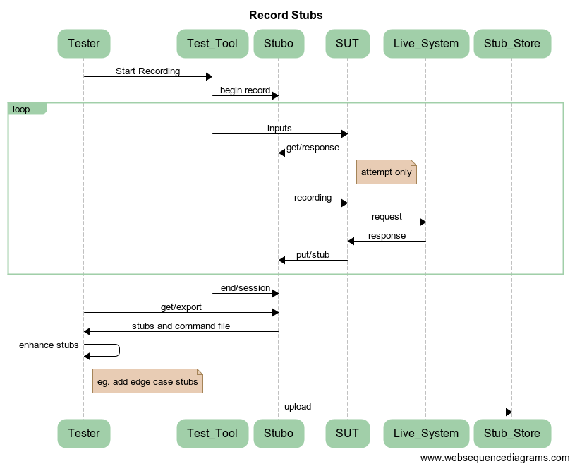

.. clients

***************************
Clients (Mirage Integrator)
***************************

A Mirage integrator is responsible for diverting requests destined for real back-end
services to Mirage. As such a Mirage integrator can take many forms depending 
on the needs, language and architecture of the System Under Test (SUT).

Regardless of the SUT architecture calls to Mirage are REST-ful (ish) HTTP.

Test data Setup and Teardown
============================

The basic flow for tests which require test data is: 

  1. setup data
  2. run Tests
  3. teardown data.

This process can easily be automated using Mirage and your favourite test tool.
Any test tool capable of making HTTP calls can use Mirage commands directly or via.
Mirage command files, to setup and teardown test data.

Loading stubs is typically accomplished by triggering a command file. ::

    http://stubo-server/stubo/default/execCmds?cmdFile=http://URL_OF_FILE.commands

A clever touch is to add a begin/session?mode=playback... command to the end of 
the command file making the stubs ready to be used.

*Data setup and teardown need not involve the Mirage Integrator.*

To Stub or not to Stub
======================

The first decision of an integrator is to send a data request to Mirage or a Live
back-end. This choice can be made at run time or when deploying your system. Making
the choice at run time for each test message is the most powerful and flexible choice.

Use:

'xx_stb_useStub=stubo' to send data requests to Mirage, any other value will use a
live back-end.

Playback of Stubs
=================

When an integrator has taken the Mirage path it should create a get/response call
to Mirage. The request data must be put in the body of the HTTP POST. See the Mirage API documention for detail.

The integrator code should accept arguments along with the text of the actual 
request. The one mandatory argument is the Mirage 'session'. A good design is to 
pass through to Mirage any arguments with an agreed prefix (making sure to strip off the prefix before passing them through).

For example: ::

* 'xx_stb_session' becomes 'session'
* 'xx_stb_ext_module becomes 'ext_module'

Other arguments are listed in the Mirage API documention for get/response and put/stub.

Record Stubs
============

If a get/response is attempted, but the session is in record mode, Mirage will respond
stating that one should be recording. The integrator should then create and send
a put/stub call.

Using get/response as the default call and falling back to put/stub should the session
be in record mode the test system requests need only contain the Mirage session name.
The mode of the session in Mirage will drive whether a record or playback takes place.

Performance Requirements
========================
The integrator should perform better than the system being tested. If your live system should handle 1,000 
requests per second at the point of stubbing then the integrator should handle at least 1,001.
If the live back-ends might take 5 seconds to respond ensure the integrator has enough threads available to handle 
the throughput. If you scale the system by adding more of something, ensure you can add more integrators.

Error Responses
===============
Any HTTP return code equal to or above 300 indicates a problem.
There is usually nothing the integrator can do with an error apart from pass it back up the chain and call a human
